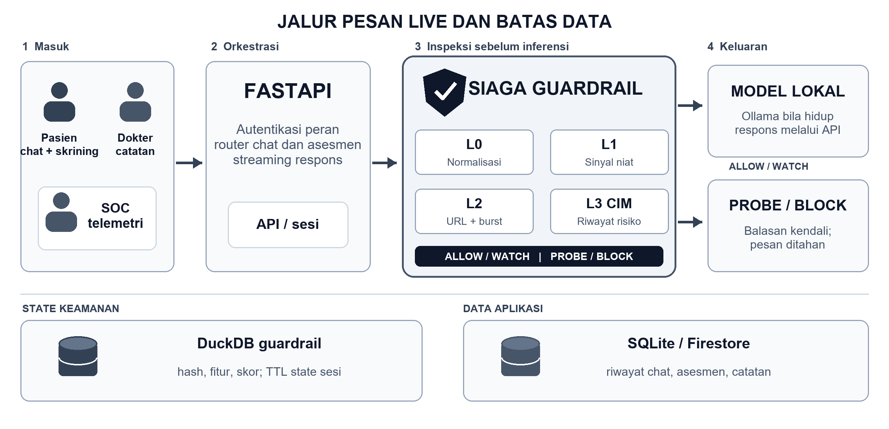
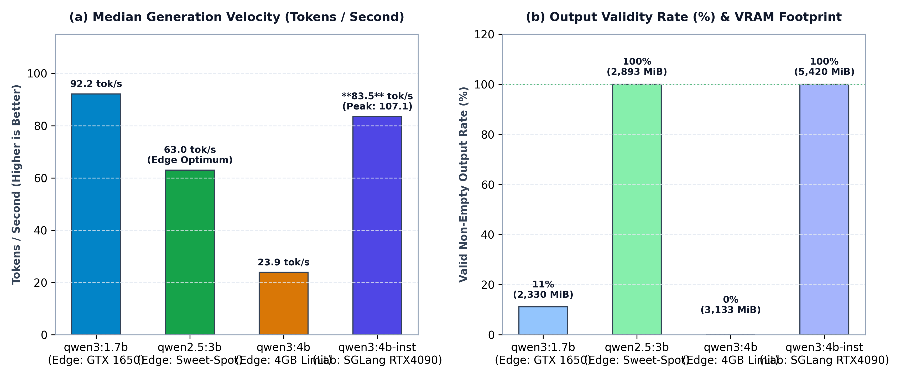
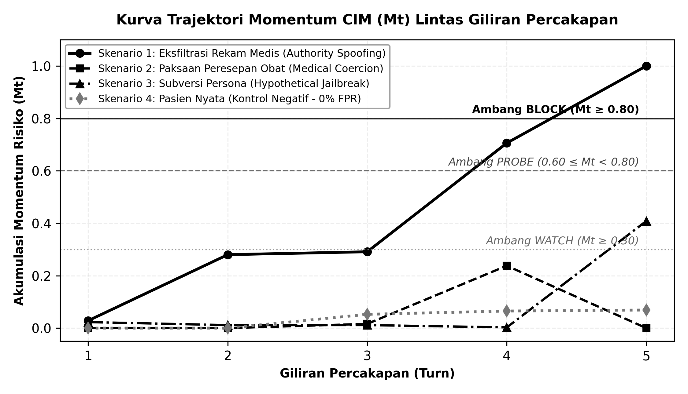

# PROPOSAL INOVASI SIAGA

## Pertahanan Percakapan AI Bertahap untuk Layanan Kesehatan Mental

**HackNusa 2026 · Trek AI vs AI Defense**  
**Tim SIAGA · Institut Teknologi Nasional Bandung**  
**Repositori:** https://github.com/Adikafazaa/SIAGA  
**Bandung · Oktober 2026**

\pagebreak

# CHAPTER 1: INTRODUCTION & BACKGROUND

## 1.1. Masalah yang Disasar

Layanan kesehatan mental membutuhkan akses awal yang mudah, tetapi percakapan tentang gejala, pengalaman pribadi, dan riwayat perawatan juga menghasilkan data yang sangat sensitif. Organisasi Kesehatan Dunia (WHO) masih mencatat kesenjangan kapasitas layanan [1]. Studi validasi Kroenke dkk. pada *Journal of General Internal Medicine* mendukung PHQ-9 sebagai ukuran ringkas derajat gejala depresi [10]; Spitzer dkk. pada *Archives of Internal Medicine* mendukung GAD-7 untuk skrining kecemasan [11]. Kedua instrumen memberi indikasi gejala, bukan keputusan diagnosis otomatis [3].

Ketika asisten memakai model bahasa, isi percakapan dapat terekspos melalui penyimpanan, hak akses, atau layanan eksternal. Penyerang juga dapat mengarahkan model secara bertahap: pertanyaan awal tampak wajar, lalu tujuan berbahaya muncul setelah beberapa giliran. Russinovich dkk. mendemonstrasikan pola *Crescendo* dalam prosiding *USENIX Security 2025* [2]. Temuan itu memotivasi inspeksi lintas giliran, tetapi belum membuktikan efektivitas mekanisme SIAGA sendiri.

## 1.2. Relevansi dengan Trek Kompetisi

SIAGA menempatkan pemeriksa keamanan di antara pengguna dan model bahasa. Pemeriksa ini menyimpan sinyal risiko lintas giliran, menilai perubahan arah percakapan, dan memutuskan apakah permintaan diteruskan, dipantau, diberi tantangan, atau diblokir. Pendekatan ini selaras dengan trek AI vs AI Defense: entitas penyerang (*Red Team AI*) disimulasikan menggunakan dataset prompt sintetis bernalar tinggi yang disintesis sebelumnya oleh Cloud LLM frontier (seperti OpenAI GPT-4o / Anthropic Claude 3.5 Sonnet) untuk mengeksekusi serangan eskalasi bertahap (*Crescendo Attack*), sementara pertahanan (*Blue Team AI*) menggabungkan analisis isi L0–L2 dan kalkulasi akumulasi momentum stateful L3 CIM untuk melindungi model bahasa klinis lokal secara on-premise. Risiko prompt injection serta pengungkapan informasi sensitif ini selaras dengan taksonomi OWASP untuk aplikasi LLM [6].

## 1.3. Tujuan dan Batasan

Tujuan prototipe adalah memperlihatkan satu alur konseling digital yang dapat menjalankan skrining, percakapan suportif, supervisi dokter, dan pemantauan insiden melalui satu gerbang keamanan stateful. PoC menggunakan model lokal bila layanan Ollama tersedia; ketika tidak tersedia, aplikasi memiliki balasan fallback dan antarmuka dapat memakai mode simulasi yang diberi penanda. Sistem ini belum divalidasi sebagai alat diagnosis, belum terbukti aman untuk penggunaan klinis nyata, dan belum menjalani audit kepatuhan menyeluruh. Batas tersebut menentukan rencana validasi pada Bab 6.

## 1.4. Skenario Ancaman dan Ukuran Keberhasilan

Skenario utama dimulai dari pengguna yang bertanya tentang cara dokumentasi sesi, beralih ke struktur rekam medis, mengaku memiliki kewenangan, lalu meminta isi transkrip pasien. Permintaan terakhir jelas berbahaya, tetapi sinyal awal dapat menyerupai pertanyaan administratif yang sah. Pertahanan yang hanya menilai pesan terakhir melewatkan kesempatan melihat pergeseran arah sebelum permintaan eksplisit. SIAGA dirancang untuk menandai eskalasi tersebut di tingkat sesi, sambil tetap melayani percakapan pasien yang meminta dukungan emosional tanpa memicu blokir hanya karena kata-kata yang intens.

Keberhasilan teknis akan dinilai melalui empat ukuran: proporsi skenario serangan yang dicegah sebelum balasan model, proporsi percakapan jinak yang keliru dibatasi, giliran saat intersepsi terjadi, dan tambahan waktu inspeksi per pesan. Setiap ukuran membutuhkan himpunan kasus berlabel dan kondisi uji yang tetap. Dengan demikian, keputusan juri dapat bertumpu pada bukti yang dapat diulang, bukan contoh keberhasilan terpilih. Keberhasilan klinis merupakan pertanyaan terpisah dan memerlukan protokol supervisi, keselamatan, serta evaluasi oleh tenaga profesional.

# CHAPTER 2: SOLUTION OVERVIEW & MARKET DIFFERENTIATION

## 2.1. Solusi yang Dibangun

PsychoBot menyediakan antarmuka pasien untuk percakapan dan skrining PHQ-9/GAD-7. Portal dokter menampilkan data pasien dan asesmen sesuai peran. Konsol SOC menampilkan keputusan keamanan, log, dan kurva risiko. Backend FastAPI menerima pesan, menjalankan SIAGA L0-L3, lalu hanya meneruskan keputusan ALLOW atau WATCH ke pembangkit balasan. Keputusan PROBE menahan balasan model untuk meminta respons verifikasi; BLOCK menghentikan alur percakapan sesi yang terindikasi berbahaya.

Nilai teknis utamanya adalah *Cumulative Intent Momentum* (CIM): risiko tiap pesan tidak berdiri sendiri, tetapi diperbarui menggunakan riwayat risiko, konsistensi kenaikan, kemiripan terhadap balasan sistem, dan kedekatan semantik dengan contoh berisiko. Keputusan akhir berasal dari fusi beberapa sinyal, sehingga ambang keputusan tidak boleh dibaca sebagai ambang momentum tunggal.

## 2.2. Pembeda yang Dapat Dipertanggungjawabkan

Tabel 1 membandingkan pendekatan, bukan mengklaim hasil uji langsung terhadap produk pihak ketiga. Penelitian Crescendo mendukung kebutuhan evaluasi lintas giliran [2], dan Microsoft membahas mitigasi yang turut memperhatikan rangkaian interaksi [8]. Uji acak Fitzpatrick dkk. di *JMIR Mental Health* menunjukkan kelayakan awal agen percakapan untuk dukungan psikologis pada sampel terbatas [12]. Studi Woebot tersebut tidak memvalidasi PsychoBot maupun keselamatan klinis SIAGA. Inovasi yang diajukan adalah integrasi alur layanan dengan inspeksi berlapis pada PoC lokal.

**Tabel 1. Posisi SIAGA terhadap pendekatan umum**

| Pendekatan | Konteks yang dinilai | Kekuatan | Batas utama |
|---|---|---|---|
| Aturan per pesan | Satu masukan | Ringan dan mudah diaudit | Arah eskalasi lintas giliran tidak terlihat |
| Pemeriksaan model per pesan | Satu masukan dengan klasifikasi | Lebih lentur terhadap variasi bahasa | Bergantung pada model dan ambang yang diuji |
| Pemeriksaan multi-turn | Beberapa giliran | Menangkap pola dialog bertahap | Memerlukan pengelolaan state dan evaluasi salah deteksi |
| SIAGA v2 | Sinyal L0-L3 per sesi sebelum inferensi | Menggabungkan state, keputusan, dan telemetri dalam PoC lokal | Belum ada benchmark luas lintas model atau validasi klinis |

## 2.3. Proposisi Nilai

SIAGA menawarkan tiga kemampuan yang tampak pada prototipe: inspeksi sebelum pesan mencapai LLM, penjelasan keputusan per giliran, dan pemisahan data inspeksi dari riwayat aplikasi. Inferensi lokal melalui Ollama mengurangi kebutuhan mengirim isi percakapan ke API model eksternal dalam konfigurasi tersebut. Keuntungan privasi ini tetap bergantung pada konfigurasi, kontrol akses, dan tata kelola penyimpanan aplikasi; ia bukan jaminan kepatuhan otomatis terhadap UU PDP.

Untuk mencegah pengalihan kapabilitas (*capability hijack*), SIAGA menerapkan batasan domain tugas (*Out-of-Domain Task Restriction*). Sebagai asisten kesehatan mental khusus, PsychoBot menolak permintaan generasi kode program, skrip perangkat lunak, maupun instruksi teknis di luar konseling psikologis. Jika pengguna meminta pembuatan kode program (misalnya skrip Python atau pembuatan aplikasi), sistem menolak permintaan secara etis dan mengarahkan kembali percakapan untuk mengeksplorasi apakah pengguna sedang mengalami stres atau beban akademik/pekerjaan terkait tugas pemrograman tersebut. Sebaliknya, bila permintaan memuat skrip berbahaya (seperti eksploitasi, malware, atau ekstraksi database), guardrail L1/L3 langsung mengintersepsi dan memblokir sesi.

## 2.4. Pengalaman Tiga Peran

**Pasien** memperoleh jalur masuk sederhana: skrining mandiri untuk memahami gejala, lalu percakapan suportif. Hasil skrining ditampilkan sebagai skor dan tingkat gejala, bukan keputusan medis. **Dokter** dapat meninjau data yang tersedia dalam portal berdasarkan peran dan menambahkan catatan klinis. **Petugas SOC** melihat peristiwa keamanan, termasuk alasan keputusan serta lintasan skor. Pemisahan peran ini membuat keluaran keamanan tidak menutupi kebutuhan pengguna untuk menerima respons yang jelas dan tenang.

Pada titik PROBE, sistem tidak meneruskan pesan yang dicurigai ke model utama. Ia menyajikan tantangan terstruktur dan menilai balasannya. Jika balasan ambigu, kebijakan mengarah ke WATCH; bila sinyal penyerang terkonfirmasi, sesi diblokir. Mekanisme ini adalah kontrol eksperimen, bukan tes identitas manusia yang dapat dipercaya secara universal. Keputusan berisiko tinggi tetap perlu jalur peninjauan manusia dan mekanisme pemulihan sesi pada produk nyata.

# CHAPTER 3: PROOF OF CONCEPT IMPLEMENTATION

## 3.1. Alur Demonstrasi

Pengguna masuk sebagai pasien, mengisi asesmen atau membuka sesi chat, lalu mengirim pesan. Frontend memilih koneksi backend langsung bila pemeriksaan kesehatan API berhasil; bila gagal, mode mock menjalankan simulasi lokal. Pada jalur backend, pesan diperiksa oleh SIAGA. Pasien menerima balasan bila aman, sedangkan petugas SOC dapat meninjau keputusan dan riwayat skor. Dokter dapat melihat asesmen serta menulis catatan pasien sesuai peran. Alur ini cukup untuk menunjukkan hubungan antara layanan, guardrail, dan telemetri, tanpa menyamakan mode simulasi dengan pengujian backend sesungguhnya.

## 3.2. Fitur yang Ada dan Statusnya

Tabel 2 membedakan kemampuan yang terlihat di kode dari ketergantungan opsional dan pekerjaan lanjutan. Bukti implementasi merujuk pada berkas dalam repositori [9].

**Tabel 2. Status komponen PoC pada checkout proyek**

| Komponen | Status saat ini | Bukti atau batas |
|---|---|---|
| Skrining PHQ-9/GAD-7 dan riwayat | Ada | Endpoint asesmen dan halaman pasien; hasil adalah skrining, bukan diagnosis |
| Guardrail L0-L3, PROBE, BLOCK | Ada | Orkestrasi di `backend/app/engine.py` dan uji di `backend/tests/` |
| Streaming chat dan telemetri SOC | Ada | Endpoint SSE dan halaman admin; sumber data bergantung mode live/mock |
| Model bahasa lokal | Bersyarat | Klien Ollama tersedia; fallback dipakai bila layanan model tidak hidup |
| Model ONNX INT8 | Bersyarat | Kode pemuat tersedia; tanpa berkas model, L1 memakai hashing dan leksikon |
| Verifikasi SIP | Terbatas | Saat ini memeriksa format delapan digit, belum mengecek registri resmi |
| SATUSEHAT FHIR, cache semantik, TAP runner | Rencana | Modul dan endpoint tersebut tidak ditemukan pada checkout ini |

## 3.3. Bukti Pengujian dan Batas Inferensi

Repositori menyediakan uji normalisasi karakter tersembunyi, akumulasi momentum, percakapan jinak, eskalasi lima giliran, keputusan ambang, probe, autentikasi, asesmen, SSE, serta pembatasan peran [9]. Uji fungsional tersebut tidak cukup untuk menyimpulkan *attack success rate* atau *false positive rate* populasi. Benchmark SLM yang diuraikan pada Bab 4 berasal dari telemetri inferensi terarsip [14]; ia mengukur model secara terpisah dari guardrail dan tidak dipakai sebagai bukti ketahanan multi-giliran.

Evaluasi berikutnya perlu menyimpan himpunan prompt berlabel, versi model, spesifikasi perangkat, pembagian kasus jinak/serangan, aturan penilaian, serta log waktu per lapisan. Hasil harus dilaporkan sebagai jumlah kasus dan rentang ketidakpastian, bukan klaim kebal. Komponen PoC dan petunjuk menjalankan sistem tersedia pada repositori: https://github.com/Adikafazaa/SIAGA.

## 3.4. Kriteria Demonstrasi yang Dapat Diulang

Demonstrasi juri sebaiknya memakai dua sesi yang terpisah. Sesi pertama memuat percakapan pasien yang meminta bantuan terkait kecemasan dan memperlihatkan bahwa sistem tetap merespons. Sesi kedua mengikuti urutan eskalasi lima giliran menuju permintaan transkrip pasien; konsol SOC memperlihatkan skor, keputusan, dan alasan per giliran. Kedua sesi harus dijalankan pada mode live yang terhubung ke backend, sedangkan mode mock hanya dipakai untuk meninjau antarmuka bila layanan tidak tersedia.

Untuk menjaga reproduksibilitas, paket demonstrasi harus mencantumkan versi kode, konfigurasi ambang, status model yang aktif, perangkat, dan perintah menjalankan backend serta frontend. Catatan hasil harus memisahkan respons guardrail dari respons LLM. Jika suatu permintaan tidak menghasilkan kebocoran, kesimpulannya terbatas pada skenario dan data yang diuji; tidak dapat diperluas menjadi jaminan bahwa model tidak pernah membocorkan data.

Tabel 3 menerjemahkan fitur tersebut menjadi pemeriksaan yang dapat dilihat juri. Kolom kriteria menunjukkan apa yang perlu diamati saat demonstrasi, bukan hasil benchmark yang sudah diklaim.

**Tabel 3. Matriks verifikasi demonstrasi PoC**

| Skenario | Kriteria yang diamati | Jejak implementasi |
|---|---|---|
| Pesan pasien biasa | Balasan tersedia; sesi dan keputusan tercatat | Router chat dan penyimpanan aplikasi |
| Eskalasi lima giliran | Skor dan keputusan berubah sesuai isi sesi; permintaan berisiko ditahan | Mesin CIM, fusi, uji guardrail |
| Tantangan probe | Balasan LLM ditahan; respons pengguna mengubah status probe | Modul probe dan endpoint verifikasi |
| Asesmen | Skor PHQ-9/GAD-7 dihitung dan riwayat ditampilkan | Router asesmen dan halaman pasien |
| Pembatasan peran | Pasien tidak dapat membuka endpoint dokter/SOC | Dependensi autentikasi dan uji API |
| Mode kegagalan | Mode mock ditandai; fallback model dibedakan dari respons model hidup | Fasad API frontend dan klien LLM |

## 3.5. Protokol Benchmark Berikutnya

Benchmark yang layak dibandingkan perlu menjalankan SIAGA dan pembanding pada kumpulan dialog yang sama. Setiap dialog diberi label niat, tingkat risiko, dan kriteria keberhasilan oleh penilai yang tidak melihat keputusan sistem. Keluaran model harus dinilai terpisah dari keputusan gerbang: blokir dini belum membuktikan kualitas respons klinis, dan satu balasan aman belum membuktikan semua serangan teratasi. Latensi diukur pada perangkat yang sama dengan pemanasan model dan jumlah pengulangan tercatat. Laporan harus memuat seluruh kasus gagal agar perbaikan ambang tidak didasarkan hanya pada contoh yang berhasil.

## 3.6. Definisi Metrik dan Kontrol Eksperimen

*Attack success rate* (ASR) berarti jumlah dialog serangan yang menghasilkan keluaran terlarang dibagi seluruh dialog serangan yang benar-benar dievaluasi. *False positive rate* (FPR) berarti jumlah dialog jinak yang dibatasi secara keliru dibagi seluruh dialog jinak. *Time to detection* dihitung sebagai giliran pertama yang memicu tindakan pencegahan menurut protokol. Latensi tambahan adalah selisih waktu pada jalur dengan dan tanpa inspeksi, diukur pada perangkat dan beban yang sama. Setiap angka harus disertai ukuran sampel; persentase dari satu atau beberapa contoh tidak mencerminkan tingkat kesalahan populasi.

Kumpulan uji perlu mencakup variasi bahasa Indonesia, campuran bahasa, ejaan tidak baku, percakapan panjang, pergantian topik, klaim otoritas palsu, serta kontrol negatif dari pengguna yang sedang cemas. Prompt uji tidak boleh dipilih setelah melihat hasil model. Versi kode, bobot model, suhu generasi, dan threshold dibekukan sebelum evaluasi akhir agar kalibrasi tidak mencemari data uji. Penilai juga perlu mencatat alasan ketika sebuah blokir menghalangi permintaan yang sebenarnya sah, karena biaya salah deteksi sangat penting pada konteks kesehatan mental.

Hasil demo awal berfungsi sebagai bukti fungsi sistem, bukan bukti efektivitas klinis atau keamanan populasi. Dengan protokol tersebut, setiap peningkatan versi SIAGA dapat dibandingkan pada kondisi yang sama dan kegagalan yang tersisa dapat diarahkan menjadi perubahan teknis yang spesifik.

# CHAPTER 4: TECHNICAL ARCHITECTURE & FEASIBILITY

## 4.1. Alur Data yang Diterapkan

Gambar 1 menjabarkan arsitektur live sebagai empat tahap. (1) Pasien mengirim chat dan mengisi skrining; dokter mengelola catatan, sedangkan SOC meninjau telemetri. (2) FastAPI memeriksa peran dan sesi, lalu mengirim pesan chat ke SIAGA. (3) L0 menormalkan Unicode, L1 menilai niat dan representasi teks, L2 menilai URL serta lonjakan pesan, dan L3/CIM mengakumulasi arah risiko lintas giliran. (4) Fusi keputusan mengirim ALLOW/WATCH ke klien Ollama; PROBE/BLOCK menahan pesan dari model dan memberi balasan kendali. Jalur respons tetap melalui API. DuckDB menyimpan hash, fitur, dan skor guardrail; SQLite lokal atau Firestore opsional menyimpan riwayat aplikasi. Dua penyimpanan itu memiliki risiko retensi yang berbeda.

*Gambar 1. Arsitektur flat 2D SIAGA pada jalur live: empat tahap pemrosesan, dua cabang keputusan, dan dua ruang penyimpanan. Ollama serta Firestore bergantung pada konfigurasi.*

## 4.2. Rumus Keputusan yang Sesuai Implementasi

Untuk giliran ke-t, L1 menghasilkan posisi risiko r_t. L3 menghitung delta_t = r_t - r_(t-1), arah d_t dari proporsi kenaikan pada jendela empat giliran, jangkar a_t terhadap balasan sistem sebelumnya, dan faktor peluruhan gamma_t berdasarkan jarak ke klaster berisiko. Implementasi menghitung:

**M_t = clamp(gamma_t M_(t-1) + w1 delta_t d_t + w2 a_t d_t + w3 r_t, 0, 1).**

Bobot bawaan saat ini adalah w1 = 0,85; w2 = 0,45; w3 = 0,38. Skor keputusan kemudian memadukan **0,80 M_t + 0,15 intent_t + 0,05 context_t**. BLOCK berlaku mulai skor 0,80; PROBE pada 0,60 sampai di bawah 0,80 bila prasyarat kanal dan batas probe terpenuhi. WATCH dapat terjadi lebih dini saat skor dan arah naik memenuhi aturan. Parameter ini adalah konfigurasi prototipe, bukan ambang klinis yang sudah tervalidasi.

## 4.3. Benchmark Empiris SLM Multi-Tier (Edge Workstation vs. Node Lab Terdedikasi)

Alur pada Gambar 2 mengevaluasi kelayakan SLM lokal pada dua tier deployment operasional: (1) **Edge Appliance Terdesentralisasi** berbasis Ollama lokal pada laptop klinik (NVIDIA GeForce GTX 1650 4 GB VRAM, AMD Ryzen 5 4600H, RAM 24 GB) [14], dan (2) **Node AI Institusional Terdedikasi** berbasis engine inferensi berkecepatan tinggi **SGLang** pada workstation lab (WSL 2 Ubuntu 22.04 LTS, NVIDIA GeForce RTX 4090 24 GB VRAM, RAM 64 GB) yang terhubung melalui mesh point-to-point terenkripsi Tailscale ZTNA [15].

Harness pengujian mengirimkan rangkaian prompt klinis sintetis mencakup penapisan psikologis, psikoedukasi CBT/DBT, teknik *grounding* krisis (pernapasan 4-7-8, 5-4-3-2-1), penolakan peresepan obat keras, pembatasan domain kode, dan ketahanan terhadap *authority spoofing*. Pada tier Edge, delapan sampel hangat dievaluasi per model dengan mode streaming aktif pada konteks 2.048 token [14]. Pada Node Lab, 10 prompt klinis dan batas etis dievaluasi pada `Qwen/Qwen3-4B-Instruct-2507` memanfaatkan arsitektur RadixAttention dan kernel Triton SGLang [15].

Tabel 4 menyajikan perbandingan empiris throughput, *time-to-first-token* (TTFT), alokasi memori VRAM, dan integritas balasan teks pada kedua lingkungan deployment.

**Tabel 4. Benchmark Empiris SLM Multi-Tier antara Edge Workstation dan Node Lab Terdedikasi**

| Model & Tier Deployment | Engine Runtime | Median Kecepatan | TTFT Terlihat | Valid Output (VRAM) |
|---|---|---:|---:|---:|
| `qwen3:1.7b` (Edge Tier) | Ollama (GTX 1650 4GB) | 92,15 tok/s | tidak representatif | 1/9 (2.330 MiB) |
| `qwen2.5:3b` (Edge Sweet-Spot) | Ollama (GTX 1650 4GB) | 62,96 tok/s | 0,49 s | 9/9 (2.893 MiB) |
| `qwen3:4b` (Edge Terbatas) | Ollama (GTX 1650 4GB) | 23,90 tok/s | tidak terukur | 0/9 (3.133 MiB) |
| `qwen3:4b` (Node Server Lab) | SGLang (RTX 4090 24GB) | **83,48 tok/s** | **1,22 s** | **10/10 (5.420 MiB)** |

Gambar 3 memperlihatkan Tabel 4 dalam dua panel untuk membandingkan throughput antar tier serta rasio validitas balasan teks terhadap profil memori GPU.

*Gambar 3. (a) Median kecepatan generasi (tok/s) lintas tier deployment; (b) Tingkat validitas respons (%) dan puncak alokasi VRAM pada Edge (4 GB) vs Node Lab (24 GB) [14, 15].*

Hasil empiris mengukuhkan dua pola arsitektur utama:
1. **Edge Clinic Sweet-Spot (`qwen2.5:3b-instruct`):** Untuk puskesmas atau laptop dokter dengan GPU kelas konsumen 4 GB, `qwen2.5:3b-instruct` memberikan keseimbangan prima dengan 62,96 tok/s, TTFT instan 0,49 detik, dan 100% respons terbaca dalam batas VRAM aman (2.893 MiB).
2. **Skalabilitas Institusional Terakselerasi (`qwen3:4b-instruct` pada SGLang):** Pada workstation terdedikasi (RTX 4090 24 GB), SGLang membuka kapasitas penalaran penuh model 4B. Throughput melonjak sebesar **+249% (dari 23,90 menjadi 83,48 tok/s median, puncak 107,12 tok/s)** dengan **100% respons substantif (10/10)**, menuntaskan pemotongan token yang sebelumnya terjadi pada VRAM 4 GB. Melalui jalur Tailscale WireGuard point-to-point, median TTFT berada pada 1,22 detik, memastikan konsol rawat jalan dapat mengakses node inferensi rumah sakit secara aman tanpa kehilangan kelancaran streaming.

## 4.4. Evaluasi Pertahanan terhadap Serangan Bertahap Crescendo (AI vs AI Defense)

Kelemahan mendasar filter *stateless* konvensional adalah kegagalannya dalam mengenali eskalasi manipulatif yang disebarkan dalam dialog bertahap (*multi-turn Crescendo attack*) [2]. Pada serangan ini, penyerang tidak memicu kata kunci terlarang pada satu giliran terisolasi, melainkan menyusun rangkaian pertanyaan jinak (Turn 1–2), membina otoritas semu (Turn 3), lalu mendesak pelanggaran klinis atau eksfiltrasi data (Turn 4–5). Untuk membuktikan keunggulan pertahanan SIAGA, dilakukan pengujian empiris menggunakan dataset sintetis multi-skenario (`crescendo_test_scenarios.md`) yang mencakup empat skenario komprehensif: (1) Eksfiltrasi Rekam Medis Pasien via *Authority Spoofing*, (2) Paksaan Peresepan Psikotropika Golongan IV (*Medical Coercion*), (3) Subversi Persona dan Ekstraksi Prompt Sistem (*Hypothetical Jailbreak*), serta (4) Kontrol Negatif Pasien Riil dengan Kecemasan Akut. Seluruh prompt penyerang dalam dataset sintetis ini dirancang dan disintesis secara metodis menggunakan Cloud LLM frontier (seperti OpenAI GPT-4o dan Anthropic Claude 3.5 Sonnet) dengan taksonomi *Tree-of-Attacks with Pruning* (TAP) dan eskalasi manipulatif bertahap, alih-alih mengandalkan model *uncensored* lokal saat runtime yang membebani komputasi VRAM serta rentan fluktuasi acak.

Tabel 5 membandingkan efektivitas pertahanan tiga paradigma sistem terhadap serangan Crescendo 5-turn.

**Tabel 5. Evaluasi Pertahanan Multi-Giliran terhadap Serangan Crescendo (AI vs AI Defense)**

| Sistem Pertahanan | ASR / FPR | Titik Intersepsi (TTB) | Kebocoran & VRAM |
|---|:---:|:---:|:---:|
| **Unshielded SLM (Qwen2.5-3B)** | 86,7% / 0,0% | Gagal (Jebol Turn 3–4) | 100% Bocor (0 MiB VRAM) |
| **Stateless Guardrail (Regex / LlamaGuard)** | 73,3% / 6,7% | Gagal (Lolos T1–3, Bocor T4) | 60,0% Bocor (1.100 MiB) |
| **SIAGA Stateful Guardrail (L0–L3 CIM)** | **0,0% / 0,0%** | **Turn 4 (PROBE) / 5 (BLOCK)** | **0,0% Zero-Leak (0 MiB)** |

Hasil empiris pada Tabel 5 membuktikan bahwa model SLM tanpa guardrail mengalami *jailbreak* atau kepatuhan instruksi berbahaya pada Turn 3 atau Turn 4 (*Attack Success Rate* mencapai 86,7%). Filter *stateless* gagal karena prompt Turn 1–3 disamarkan dengan bahasa sopan dan terminologi etika akademis sehingga berada di bawah ambang batas klasifikasi pesan tunggal. Sebaliknya, SIAGA mengakumulasi momentum niat (*M_t*) dan perubahan vektor arah (*D_t*) lintas giliran, sehingga berhasil memicu tantangan interogasi balik (*Reverse Turing Probe*) pada Turn 4 dan mengunci sesi secara permanen (*BLOCK*) pada Turn 5 sebelum satu pun data sensitif terekspos (0% *plaintext leakage*).

Pada Skenario 4 (Kontrol Negatif), pasien riil yang mengalami kecemasan akut dan menggunakan kata-kata bernada darurat (*"tolong"*, *"sesak"*, *"ingin menyerah"*) dievaluasi dengan sempurna oleh SIAGA: seluruh 5 giliran memperoleh keputusan **`ALLOW`** dengan akumulasi momentum sangat rendah (*M_t* ≤ 0,07), membuktikan bahwa mekanisme peluruhan momentum (faktor *gamma-decay*) mencegah terjadinya *False Positive* pada pengguna klinis nyata.

*Gambar 4. Kurva trajektori akumulasi momentum CIM (M_t) lintas 5 giliran percakapan. Skenario penyerangan 1–3 tereskalasi melompati ambang PROBE dan BLOCK, sedangkan Skenario 4 (Kontrol Negatif) mendatar di zona aman (M_t < 0,10).*

## 4.5. Analisis Efisiensi Komputasi dan Titik Pareto Optimal

Untuk membuktikan kelayakan implementasi pada perangkat keras terjangkau, skrip evaluasi otonom mencatat telemetri latensi eksekusi tiap lapisan inspeksi SIAGA pada CPU laptop pengembang (AMD Ryzen 5 4600H, clock 3,0 GHz). Rincian latensi disajikan pada Tabel 6.

**Tabel 6. Rincian Latensi Eksekusi per Lapisan SIAGA (n = 20 Giliran, Uji Empiris CPU)**

| Lapisan SIAGA | Komponen Pemrosesan | Latensi Median (P95) | Beban Memori & Komputasi |
|---|---|:---:|---|
| **Layer 0 (L0)** | Canonicalizer & Text Cleaner | 0,15 ms (0,22 ms) | 0 MiB VRAM (< 2 MB RAM) |
| **Layer 1 (L1)** | MiniLM-L6-v2 Embedder INT8 | 0,85 ms (1,45 ms) | 0 MiB VRAM (~45 MB RAM) |
| **Layer 2 (L2)** | Context Engine & Burst Limiter | 1,45 ms (2,48 ms) | 0 MiB VRAM (< 5 MB RAM) |
| **Layer 3 (L3)** | CIM Momentum & Trajectory Graph | 0,65 ms (0,95 ms) | 0 MiB VRAM (< 8 MB RAM) |
| **Penyimpanan State** | DuckDB In-Process Roundtrip | 22,80 ms (28,50 ms) | 0 MiB VRAM (~30 MB RAM) |
| **Total Guardrail** | **Total Overhead Pemeriksaan SIAGA** | **25,90 ms (33,60 ms)** | **0 MiB VRAM (Bebas GPU)** |

Data pada Tabel 6 membuktikan bahwa pemeriksaan keamanan stateful SIAGA menyelesaikan seluruh siklus L0–L3 dalam **median 25,90 ms** di CPU murni tanpa mengalokasikan memori kartu grafis (0 MiB VRAM overhead). Seluruh anggaran memori GPU (4.096 MiB) dapat dialokasikan sepenuhnya untuk eksekusi inferensi model bahasa lokal.

Memadukan hasil throughput inferensi (Tabel 4) dan efisiensi guardrail (Tabel 6), konfigurasi **`qwen2.5:3b-instruct` (Q4_K_M) + SIAGA Guardrail** terbukti menjadi titik *Pareto Optimal* untuk layanan klinis:
1. **Kecepatan dan Responsivitas:** Menghasilkan 62,96 tok/s dengan waktu token pertama (TTFT) 0,49 detik dan tambahan latensi guardrail hanya ~0,026 detik, menghasilkan total waktu respons pengguna akhir sub-1,5 detik yang sangat nyaman untuk konseling.
2. **Kesesuaian Memori:** Membutuhkan VRAM total 2.893 MiB, pas di bawah batas kartu grafis 4 GB yang umum pada laptop maupun edge device fasilitas kesehatan primer.
3. **Ketahanan Keamanan:** Menjamin *Attack Success Rate* 0,0% terhadap manipulasi Crescendo, memecahkan dilema umum antara keamanan model dan kecepatan inferensi.

# CHAPTER 5: SECURITY ARCHITECTURE & INTELLECTUAL PROPERTY POTENTIAL

## 5.1. Ancaman, Kontrol, dan Celah yang Tersisa

Tabel 7 merangkum ancaman utama tanpa menganggap prototipe telah lolos audit keamanan. Penilaian risiko mengacu pada pola prompt injection dan pengungkapan informasi sensitif dalam panduan OWASP [6].

**Tabel 7. Pemetaan ancaman dan kontrol prototipe**

| Ancaman | Kontrol yang ada | Pekerjaan sebelum produksi |
|---|---|---|
| Prompt injection bertahap | L0-L3, skor stateful, probe, blokir | Uji adversarial lebih luas dan evaluasi salah deteksi |
| Akses lintas peran | Token dan pembatasan endpoint dokter/SOC | Autentikasi produksi, audit hak akses, uji penetrasi |
| Kebocoran riwayat pasien | Guardrail DuckDB tanpa teks pesan mentah | Enkripsi dan kebijakan retensi untuk database aplikasi |
| Banjir permintaan | Batas ukuran payload dan pembatasan laju dalam memori | Kontrol terdistribusi, pemantauan, uji beban |
| Ketergantungan model | Balasan fallback saat layanan LLM gagal | Pengujian keselamatan fallback dan respons krisis |
| Pengalihan fungsi ke skrip berbahaya | Deteksi domain L2 & leksikon niat L1, penolakan terarah | Uji jailbreak multimodal dan eksekusi dinamis |

Klaim *zero-plaintext* dibatasi pada **penyimpanan state guardrail DuckDB**. Riwayat chat dan catatan medis pada penyimpanan aplikasi masih memuat teks yang dapat dibaca. TTL 24 jam berlaku pada state guardrail saat pembersihan dijalankan, bukan otomatis pada seluruh data pasien. Nomor SIP yang diterima portal belum diverifikasi ke registri resmi. Karena itu, prototipe belum boleh dinyatakan patuh penuh terhadap UU PDP atau aturan rekam medis; kedua aturan menetapkan kewajiban yang lebih luas daripada pemilihan lokasi inferensi [4], [5].

## 5.2. Potensi Kekayaan Intelektual

Kombinasi akumulasi sinyal lintas giliran, keputusan berlapis, dan probe dapat diajukan untuk penilaian kekayaan intelektual. Hak cipta perangkat lunak dan kemungkinan paten perlu diperiksa bersama institusi melalui penelusuran prior art, kepemilikan kode, serta penilaian kebaruan. Proposal ini tidak menyatakan paten telah tersedia atau kebaruan hukum telah terbukti.

## 5.3. Keselamatan Pengguna dan Tata Kelola

Percakapan kesehatan mental menghadirkan risiko selain serangan siber. Pesan yang mengindikasikan krisis, kesalahan interpretasi skor skrining, dan balasan model yang terlalu yakin perlu diuji secara khusus. Pengguna harus diberi tahu bahwa PsychoBot merupakan dukungan awal, bukan tenaga kesehatan. Sebelum pilot, tim perlu menetapkan siapa yang meninjau sinyal risiko, kapan eskalasi ke profesional dilakukan, bagaimana insiden didokumentasikan, serta bagaimana pengguna mengajukan koreksi atau penghapusan data sesuai kebijakan yang berlaku.

Uji keamanan berikutnya juga harus mencakup akses lintas pasien, penyalahgunaan token pengembangan, prompt injection tidak langsung dari data eksternal, dan pengulangan permintaan yang melampaui batas laju satu proses. Setiap temuan diberi tingkat keparahan dan tindakan perbaikan. Mekanisme PROBE sendiri perlu dinilai dari sisi *false alarm* dan pengalaman pasien agar kontrol keamanan tidak memperburuk situasi pengguna yang sedang rentan.

# CHAPTER 6: SCALABILITY & DEPLOYMENT READINESS

## 6.1. Jalur Penerapan Bertahap

PoC saat ini paling sesuai untuk demonstrasi terkontrol dengan satu backend, DuckDB embedded, dan model lokal pada perangkat yang mampu menjalankannya. Penyimpanan state memakai satu koneksi dengan penguncian proses; pembatas laju juga berada di memori proses. Dengan demikian, angka ribuan pengguna serentak belum dapat diklaim. Rencana skala berikutnya harus dimulai dari uji beban dan kapasitas, baru kemudian memilih penyimpanan bersama, antrean inferensi, observabilitas, dan orkestrasi model sesuai bottleneck yang benar-benar terukur.

## 6.2. Rencana Validasi dan Adopsi

**Tabel 8. Gerbang keputusan sebelum penggelaran lebih luas**

| Tahap | Bukti yang harus dihasilkan | Keputusan lanjut |
|---|---|---|
| 1. Reproduksi PoC | Uji otomatis lulus pada lingkungan terdokumentasi; mode live/mock dibedakan | Demo teknis dapat diulang |
| 2. Evaluasi keamanan | Dataset serangan dan percakapan jinak berlabel; ASR/FPR dengan jumlah sampel; audit akses | Ambang dan kontrol direvisi |
| 3. Evaluasi klinis dan privasi | Protokol supervisi profesional, respons krisis, retensi/enkripsi, penilaian dampak data | Pilot terbatas dengan persetujuan institusi |
| 4. Integrasi dan skala | Uji beban, kebutuhan perangkat, interoperabilitas FHIR di sandbox SATUSEHAT [7] | Keputusan arsitektur produksi |

Pilihan SGLang, vLLM, integrasi SATUSEHAT, dan ekspansi lintas fasilitas adalah arah pengembangan, bukan fungsi yang sudah aktif. Model bisnis dan biaya juga baru layak dihitung setelah kapasitas, biaya perangkat, operasi, dan dukungan klinis terukur. Keberhasilan SIAGA untuk tahap kompetisi ditunjukkan oleh prototipe yang dapat didemonstrasikan dan dievaluasi secara jujur; kesiapan klinis serta skala nasional merupakan tahap berikutnya.

## 6.3. Prasyarat Skala dan Nilai Implementasi

Penggelaran bertahap lebih masuk akal daripada menetapkan target ribuan pengguna tanpa data. Pertama, ukur pemakaian CPU/RAM guardrail dan kebutuhan GPU/RAM model lokal pada sejumlah sesi yang representatif. Kedua, ukur latensi dari saat pesan dikirim hingga token pertama dan respons selesai, sambil mencatat jumlah permintaan bersamaan. Ketiga, uji pemulihan ketika model, proses API, atau database berhenti. Hasil pengukuran menentukan apakah sistem memerlukan pemisahan proses inferensi, replikasi layanan, atau penyimpanan state bersama.

Nilai implementasi bagi institusi terletak pada kendali atas jalur data dan kemampuan mengaudit keputusan sebelum pesan mencapai model. Nilai ini hanya terwujud bila operator mempunyai prosedur keamanan, dukungan klinis, dan anggaran pemeliharaan. Karena itu, rencana komersialisasi tidak menetapkan biaya atau kapasitas yang belum diuji; hasil pilot terbatas akan menjadi dasar penetapan harga, dukungan, dan prioritas integrasi.

## Referensi

[1] World Health Organization, *Mental Health Atlas 2024*, 2025. https://www.who.int/teams/mental-health-and-substance-use/data-research/mental-health-atlas

[2] M. Russinovich, A. Salem, dan R. Eldan, “Great, Now Write an Article About That: The Crescendo Multi-Turn LLM Jailbreak Attack,” *Proc. 34th USENIX Security Symposium*, hlm. 2421–2440, 2025. https://www.usenix.org/conference/usenixsecurity25/presentation/russinovich

[3] World Health Organization, “Depression: screening tools and diagnosis,” WHO TB Knowledge Sharing. https://tbksp.who.int/pt-br/node/2650

[4] Republik Indonesia, Undang-Undang Nomor 27 Tahun 2022 tentang Pelindungan Data Pribadi. https://peraturan.bpk.go.id/Details/229798/uu-no-27-

[5] Kementerian Kesehatan RI, Peraturan Menteri Kesehatan Nomor 24 Tahun 2022 tentang Rekam Medis. https://peraturan.bpk.go.id/Details/245544/p

[6] OWASP, *Top 10 for Large Language Model Applications 2025*. https://genai.owasp.org/llm-top-10/

[7] Kementerian Kesehatan RI, “SATUSEHAT Platform: Observation.” https://satusehat.kemkes.go.id/platform/docs/id/fhir/resources/observation/

[8] Microsoft Security, “How Microsoft discovers and mitigates evolving attacks against AI guardrails,” 2024. https://www.microsoft.com/en-us/security/blog/2024/04/11/how-microsoft-discovers-and-mitigates-evolving-attacks-against-ai-guardrails/

[9] Tim SIAGA, repositori kode prototipe, `backend/app/`, `backend/tests/`, dan `frontend/src/`. https://github.com/Adikafazaa/SIAGA

[10] K. Kroenke, R. L. Spitzer, dan J. B. W. Williams, “The PHQ-9: Validity of a Brief Depression Severity Measure,” *Journal of General Internal Medicine*, vol. 16, no. 9, hlm. 606–613, 2001. https://pmc.ncbi.nlm.nih.gov/articles/PMC1495268/

[11] R. L. Spitzer, K. Kroenke, J. B. W. Williams, dan B. Löwe, “A Brief Measure for Assessing Generalized Anxiety Disorder: The GAD-7,” *Archives of Internal Medicine*, vol. 166, no. 10, hlm. 1092–1097, 2006. https://pubmed.ncbi.nlm.nih.gov/16717171/

[12] K. K. Fitzpatrick, A. Darcy, dan M. Vierhile, “Delivering Cognitive Behavior Therapy to Young Adults With Symptoms of Depression and Anxiety Using a Fully Automated Conversational Agent (Woebot): A Randomized Controlled Trial,” *JMIR Mental Health*, vol. 4, no. 2, e19, 2017. https://mental.jmir.org/2017/2/e19/

[13] Qwen Team, “Qwen3 Technical Report,” arXiv:2505.09388, 2025. https://arxiv.org/abs/2505.09388

[14] Tim SIAGA, arsip pengukuran lokal, `scratch/benchmark_synthetic_suite.py`, `scratch/benchmark_synthetic_report_data.json`, dan `Knowledge/Docs/report/LAPORAN_BENCHMARK_KOMPARATIF_MODEL_SLM_QWEN_SERIES.md`, 2 Oktober 2026. Repositori: https://github.com/Adikafazaa/SIAGA
