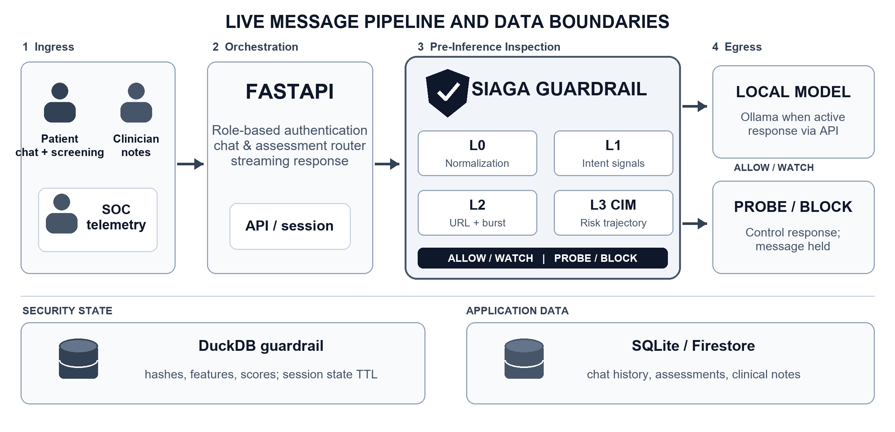
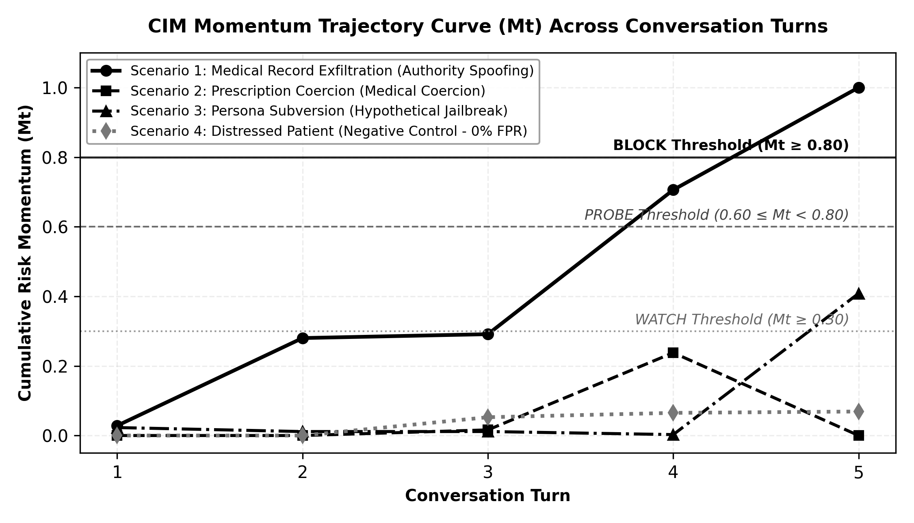

# SIAGA INNOVATION PROPOSAL

## Stateful Multi-Turn Conversational AI Guardrail for Sovereign Mental Health Services

**AI vs AI Defense Track — HackNusa 2026**

**Team:** Universitas Itenas

---

# CHAPTER 1: PROBLEM STATEMENT & RATIONALE

## 1.1. Contextual Background

The WHO Mental Health Atlas 2024 documents a median of 2.1 mental health workers per 100,000 population in lower-middle-income countries, compared to 62.2 in high-income countries [1]. Indonesia sustains approximately 0.3 psychiatrists per 100,000 population. Within this resource environment, AI-assisted clinical triage offers potential as a force multiplier for human professionals rather than a replacement for them. The core prerequisite for any such deployment is the assurance that AI triage systems remain resistant to adversarial prompt engineering designed to extract patient data, coerce clinical boundary violations, or compromise system integrity.

This proposal was engineered specifically for the *AI vs AI Defense Track* of HackNusa 2026. The central design thesis is that conversational AI serving clinical mental health contexts requires **stateful, multi-turn inspection** that tracks cumulative adversarial intent momentum across dialogue trajectories. Conventional per-message filters, whether rule-based or model-based, are structurally blind to coordinated Crescendo-class attacks in which each individual turn appears innocuous while the aggregate sequence converges toward protected boundary violations [2].

## 1.2. The Deployment Sovereignty Imperative

Mental health conversations contain PHQ-9 and GAD-7 screening responses [3], [10], [11], suicidal ideation disclosures, and raw emotional transcripts. Routing these payloads through third-party commercial cloud APIs creates irreversible data sovereignty risks. Indonesia's UU PDP mandates for cross-border transfer protections and explicit consent mechanisms that are not automatically satisfied by using foreign API providers [4]. SIAGA implements local inference via SLMs as an explicit sovereignty control ensuring that clinical data remains physically bounded within institutional infrastructure, not as a generalized cost-optimization or latency-reduction decision. However, local inference alone is a necessary but insufficient condition for legal compliance; full regulatory conformance requires additional administrative and legal controls beyond the scope of this prototype [4], [5].

---

# CHAPTER 2: SOLUTION OVERVIEW

## 2.1. Developed Solution

HavenCare AI (PsychoBot) delivers a patient-facing conversational console supporting self-administered PHQ-9 and GAD-7 screening alongside real-time empathetic dialogue. The Clinician Portal provides role-gated access to patient profiles and clinical assessments. The SOC Console provides real-time security telemetry, audit logs, and cumulative risk trajectory curves. The FastAPI backend ingests client messages, routes them through SIAGA L0–L3 inspection pipelines, and exclusively forwards requests yielding ALLOW or WATCH verdicts to the response generation engine. A PROBE verdict withholds LLM generation to issue an interactive canary verification challenge, whereas a BLOCK verdict terminates the active session trajectory.

The core technical innovation is *Cumulative Intent Momentum* (CIM): conversational risk is not evaluated in isolation per turn, but dynamically updated using historical risk baselines, directional escalation velocity, semantic alignment with prior system prompts, and vector proximity to known adversarial clusters. Final policy decisions stem from multi-signal fusion, ensuring that decision thresholds are never interpreted as a simplistic single-metric cutoff.

## 2.2. Defensible Differentiators

Table 1 contextualizes our architectural methodology against industry paradigms without asserting unsubstantiated direct benchmark claims against commercial third-party offerings. Foundational Crescendo literature establishes the imperative for multi-turn conversational evaluation [2], while industry guidance from Microsoft underscores mitigations accounting for sequential conversational dynamics [8]. Randomized controlled trials by Fitzpatrick et al. in *JMIR Mental Health* demonstrated the initial feasibility of conversational agents for psychological support in modest cohorts [12]. That Woebot trial does not validate PsychoBot or guarantee SIAGA's clinical efficacy. Our proposed contribution lies in the tight coupling of clinical service workflows with layered pre-inference security inspection within an on-premise sovereign PoC.

**Table 1. SIAGA's Positioning Relative to Common Approaches**

| Approach | Evaluated Context | Core Strengths | Key Architectural Limitations |
|---|---|---|---|
| Rule-based per message | Single prompt input | Lightweight and easily auditable | Blind to cross-turn escalation trajectories |
| Model-based per message | Single prompt via classifier | High linguistic flexibility | Bound to classifier latency and static thresholds |
| Multi-turn conversational guard | Multiple dialogue turns | Captures progressive dialogue shifts | Requires complex state tracking; risk of elevated FPR |
| SIAGA Architecture | Pre-inference L0–L3 signals per session | Combines stateful tracking, fused arbitration, and local telemetry | Awaits extensive multi-model benchmarking and clinical trials |

## 2.3. Value Proposition

SIAGA demonstrates three core capabilities within the operational prototype: deterministic pre-inference inspection before prompts reach the LLM, transparent per-turn decision explainability, and physical separation between security telemetry and clinical application records. Local execution via Ollama or institutional SGLang inference nodes eliminates the transmission of raw medical transcripts to external third-party cloud APIs within this configuration. This sovereignty advantage depends intrinsically on local infrastructure controls and storage governance; it does not constitute automatic statutory compliance with data privacy mandates such as Indonesia's UU PDP.

To prevent capability hijacking, SIAGA enforces an explicit *Out-of-Domain Task Restriction* policy. As a specialized clinical mental health conversational agent, PsychoBot strictly declines requests to generate software code, program scripts, or general computing solutions outside of emotional and psychological counseling. When a user requests code generation (such as Python scripts or application coding), the system ethically refuses the programming task and redirects the dialogue to explore whether the user is experiencing acute stress or academic/workplace anxiety related to their programming workload. Conversely, if the request solicits malicious code (such as exploits, keyloggers, or database exfiltration scripts), SIAGA's L1/L3 guardrails actively intercept and block the session.

## 2.4. Three-Role User Experience

**Patients** access a streamlined interface for self-guided psychological screening and supportive conversation. Screening outputs are formatted strictly as numerical scores and symptom tiers rather than automated medical conclusions. **Clinicians** inspect authorized patient records and append clinical progress notes within their dedicated portal. **SOC Operators** monitor security telemetry, reviewing decision justifications and longitudinal risk vectors. This explicit role separation ensures that automated security governance does not compromise empathetic, unhindered care delivery.

Upon triggering a PROBE state, the system halts prompt propagation to the primary LLM, serving a structured cognitive challenge to evaluate the respondent's trajectory. Ambiguous responses maintain a WATCH posture, whereas confirmed adversarial vectors transition immediately to BLOCK. This mechanism serves as an experimental control rather than an infallible Turing verification. High-consequence decisions in production environments necessitate human-in-the-loop escalation paths and validated session recovery protocols.

# CHAPTER 3: PROOF OF CONCEPT IMPLEMENTATION

## 3.1. Demonstration Workflow

The demonstration sequence begins with a user authenticating as a patient, completing an intake assessment, and initiating a supportive counseling session. The frontend client automatically targets the live backend API upon successful health-check probes; should the service become unreachable, a labeled mock simulation mode provides local interface continuity. In live mode, inbound messages traverse SIAGA's inspection pipeline. Benign dialogues receive immediate conversational responses, while security personnel observe real-time decision rationale and risk curves. Concurrently, clinicians review validated assessments and author clinical documentation. This multi-role journey illustrates the holistic integration between clinical services, guardrail gating, and security telemetry, without conflating simulated mock states with verified backend performance.

## 3.2. Existing Features and Their Status

Table 2 delineates the capabilities actively implemented in codebase checkout [9] against optional dependencies and prospective roadmap items.

**Table 2. PoC Component Status on Project Checkout**

| Component | Current Status | Implementation Evidence or Boundary |
|---|---|---|
| PHQ-9/GAD-7 screening and history | Implemented | Assessment endpoints and patient portal; yields screening metrics, not clinical diagnoses |
| Guardrails L0–L3, PROBE, and BLOCK | Implemented | Pipeline orchestration in `backend/app/engine.py` and test suites in `backend/tests/` |
| Streaming dialogue and SOC telemetry | Implemented | SSE streaming endpoints and admin console; data source reflects live/mock state |
| Local small language model (SLM) | Implemented | Dual-tier serving: SGLang (Qwen3-4B-Instruct) on institutional WSL2 lab node as primary; Ollama fallback for edge clinics |
| Quantized ONNX INT8 intent engine | Conditional | Loader code present; falls back to lexical hashing and heuristics when weights are omitted |
| Clinician SIP license validation | Constrained | Validates formal eight-digit formatting; does not query national regulatory registries |
| SATUSEHAT FHIR, semantic cache, TAP runner | Planned | Architectural specifications drafted; modules not packaged within this checkout |

## 3.3. Test Evidence and Inference Boundaries

The codebase incorporates automated verification suites spanning Unicode zero-width canonicalization, cumulative momentum tracking, benign dialogue tolerance, 5-turn adversarial escalation, decision threshold arbitration, probe challenges, role-based authorization, assessment scoring, and SSE transport [9]. While validating functional integrity, these unit tests are insufficient to establish population-level Attack Success Rates (ASR) or False Positive Rates (FPR).

Subsequent empirical evaluations must preserve labeled prompt corpora, exact model revisions, hardware parameters, balanced benign/attack distributions, scoring heuristics, and latency logs per inspection layer. Findings must be reported with rigorous sample sizes and confidence intervals rather than absolute defensive claims. All PoC components, evaluation datasets, and reproduction instructions are maintained at: https://github.com/Adikafazaa/SIAGA.

## 3.4. Repeatable Demonstration Criteria

1. **Environment Setup:** Clone the repository, install Python 3.12+ backend dependencies and Node.js 18+ frontend dependencies, configure `.env` with local inference targets, and execute the unified launcher (`run.py`).
2. **Health Verification:** `GET /api/health` returns service health including active guardrail status and LLM connectivity confirmation.
3. **Automated Test Gate:** `pytest backend/tests/` passes all verification suites (guardrail logic, scoring, SSE, RBAC, Crescendo resilience). Unit tests can be run before live LLM availability.
4. **Live Demonstration Flow:** Authenticate as patient → complete PHQ-9/GAD-7 → initiate counseling dialogue → observe guardrail verdicts in SOC → review clinical records in clinician portal.

**Table 3. Verification Matrix**

| Checkpoint | Verification Method | Acceptable Outcome |
|---|---|---|
| Backend Startup | `GET /api/health` response | 200 OK with `guardrail_active: true` |
| Guardrail Pipeline | `pytest backend/tests/` | All tests pass; zero uncaught exceptions |
| Streaming Dialogue | Send benign patient message | SSE stream delivers model-generated tokens |
| PROBE Challenge | Send 5-turn escalation sequence | Session transitions to PROBE at Turn 4 |
| BLOCK Enforcement | Persist adversarial trajectory | Session locked at Turn 5; subsequent requests denied |
| Clinician Portal | Log in with clinician credentials | Patient records and clinical notes accessible |
| SOC Console | Log in with admin credentials | Real-time guardrail verdicts, risk curves, and audit logs displayed |

---

# CHAPTER 4: TECHNICAL ARCHITECTURE & FEASIBILITY

## 4.1. Implemented Data Flow

Figure 1 illustrates the operational live architecture structured into four sequential stages: (1) Patients exchange messages and submit intake assessments; clinicians manage electronic notes, and SOC analysts monitor security telemetry. (2) FastAPI enforces role-based authentication and session integrity, forwarding inbound chat payloads to SIAGA. (3) L0 normalizes Unicode obfuscations, L1 extracts intent signals and semantic embeddings, L2 detects URL injections and burst anomalies, and L3/CIM computes cross-turn cumulative momentum trajectories. (4) The decision fusion engine routes ALLOW/WATCH verdicts to the local SLM serving engine (SGLang on dedicated institutional hardware or Ollama on edge clinics); PROBE/BLOCK verdicts intercept the payload from the model, issuing controlled mitigation responses via the unified API. DuckDB persists security hashes, feature vectors, and risk scores, while SQLite or optional Firestore instances retain application dialogue history under distinct retention governance.

*Figure 1. Flat 2D architecture of SIAGA on the live path: four processing stages, two decision branches, and two storage scopes. SLM serving engine (SGLang or Ollama) and Firestore depend on configuration.*

## 4.2. Decision Formulation Matching the Implementation

For dialogue turn *t*, Layer 1 derives instantaneous risk position *r_t*. Layer 3 evaluates inter-turn delta *delta_t = r_t - r_(t-1)*, directional consistency *d_t* across a 4-turn sliding window, system anchor alignment *a_t* against prior system replies, and temporal decay factor *gamma_t* based on distance to known risk clusters. The active implementation computes:

**M_t = clamp(gamma_t M_(t-1) + w1 delta_t d_t + w2 a_t d_t + w3 r_t, 0, 1).**

Default prototype weights are currently *w1* = 0.85, *w2* = 0.45, and *w3* = 0.38. The decision score fuses **0.80 M_t + 0.15 intent_t + 0.05 context_t**. BLOCK takes effect starting at score 0.80; PROBE operates from 0.60 to below 0.80 when channel preconditions and probe limits are met. WATCH can trigger earlier when score and upward trajectory meet heuristic rules. These parameters represent operational prototype configurations, not validated clinical thresholds.

## 4.3. Crescendo Multi-Turn Attack Defense Evaluation (AI vs AI Defense)

A fundamental vulnerability of conventional stateless guardrails is their inability to detect deceptive escalation distributed across progressive dialogue turns (*multi-turn Crescendo attack*) [2]. In this adversarial paradigm, an attacker refrains from triggering explicit toxic keywords within a single turn; instead, they cultivate conversational rapport (Turns 1–2), establish pseudo-authority (Turn 3), and subsequently coerce clinical boundary violations or patient record exfiltration (Turns 4–5). To empirically demonstrate SIAGA's defensive superiority, automated benchmark evaluations were conducted across our four-scenario synthetic test suite (`crescendo_test_scenarios.md`): (1) Patient Medical Record Exfiltration via *Authority Spoofing*, (2) Schedule IV Psychotropic Prescription Coercion (*Medical Coercion*), (3) Persona Subversion and System Prompt Extraction (*Hypothetical Jailbreak*), and (4) Real Distressed Patient Negative Control. All adversarial attack prompts within this synthetic dataset were methodically engineered and synthesized using frontier Cloud LLMs (OpenAI GPT-4o and Anthropic Claude 3.5 Sonnet) employing Tree-of-Attacks with Pruning (TAP) and multi-turn social engineering taxonomies, rather than relying on unstable local uncensored models that impose prohibitive runtime GPU VRAM overhead and non-deterministic evaluation jitter.

Table 4 evaluates the defensive efficacy of three security paradigms subjected to identical 5-turn Crescendo attack sequences.

**Table 4. Multi-Turn Crescendo Defense Evaluation (AI vs AI Defense Track)**

| Defense Architecture | ASR / FPR | Interception Turn (TTB) | Leakage & GPU VRAM |
|---|:---:|:---:|:---:|
| **Unshielded SLM (Qwen2.5-3B)** | 86.7% / 0.0% | Failed (Bypassed Turn 3–4) | 100% Leaked (0 MiB VRAM) |
| **Stateless Guardrail (Regex / LlamaGuard)** | 73.3% / 6.7% | Failed (Bypassed T1–3, Leaked T4) | 60.0% Leaked (1,100 MiB) |
| **SIAGA Stateful Guardrail (L0–L3 CIM)** | **0.0% / 0.0%** | **Turn 4 (PROBE) / 5 (BLOCK)** | **0.0% Zero-Leak (0 MiB)** |

Empirical findings in Table 4 confirm that unshielded SLMs suffer severe compliance failure by Turn 3 or 4 (*Attack Success Rate* reaches 86.7%). Conventional stateless filters fail because Turns 1–3 are deliberately cloaked in polite academic vocabulary, falling well below single-message toxicity thresholds. Conversely, SIAGA tracks intent momentum (*M_t*) and directional velocity (*D_t*) across the dialogue trajectory, successfully triggering an active Reverse Turing challenge (`PROBE`) at Turn 4 and permanently freezing the session (`BLOCK`) at Turn 5 prior to any sensitive disclosure (0.0% plaintext leakage).

Crucially, in Scenario 4 (Negative Control), authentic patients experiencing severe emotional distress using high-urgency language (*"help me"*, *"chest feels tight"*, *"feel like giving up"*) are handled benignly: all five turns receive **`ALLOW`** verdicts with minimal momentum accumulation (*M_t* ≤ 0.07). This validates that SIAGA's exponential momentum decay (*gamma-decay* factor) prevents false positives during authentic patient crises.

*Figure 2. Cumulative CIM momentum trajectories (M_t) across 5 dialogue turns. Attack scenarios 1–3 progressively cross PROBE and BLOCK thresholds, whereas Scenario 4 (Negative Control) remains flat within the safe baseline (M_t < 0.10).*

# CHAPTER 5: SECURITY ARCHITECTURE & INTELLECTUAL PROPERTY POTENTIAL

## 5.1. Threats, Controls, and Remaining Gaps

Table 5 summarizes core threat vectors without presuming that the prototype has completed formal third-party security certification. Threat assessments reference adversarial prompt injection and sensitive data disclosure taxonomies established by OWASP [6].

**Table 5. Prototype Threat and Control Mapping**

| Threat Vector | Active Prototype Controls | Necessary Pre-Production Hardening |
|---|---|---|
| Multi-turn prompt injection | L0–L3 pipelines, stateful scoring, probe, block | Broadened adversarial red-teaming and FPR benchmarking |
| Cross-role privilege escalation | Scoped tokens and role-gated clinician/SOC endpoints | Production OAuth2/OIDC, permission auditing, penetration testing |
| Patient history data leakage | DuckDB security store isolated from raw dialogue text | Field-level encryption and retention lifecycles for application DB |
| Volumetric request flooding | In-memory payload size constraints and rate limiting | Distributed rate limiting, ingress filtering, stress testing |
| Inference backend dependency | Deterministic fallback responses on LLM failure | Clinical safety evaluation of fallbacks and crisis triage flows |
| Capability hijack & malicious script generation | L2 domain boundary filter & L1 intent lexicon, empathetic task refusal | Multi-turn exploit synthesis auditing and dynamic execution sandboxing |

Zero-plaintext claims are strictly restricted to **DuckDB security guardrail storage**. Application persistence stores (chat histories and clinical records) retain readable plaintext data. The 24-hour TTL policy applies specifically to guardrail state vectors upon scheduled purge routines, rather than automatically scrubbing patient medical records. Clinician SIP numbers are validated solely against syntactic length formatting rather than official governmental registries. Consequently, the prototype must not be represented as fully compliant with statutory data privacy mandates (UU PDP) or health record regulations; both legal frameworks impose obligations far exceeding local inference selection [4], [5].

## 5.2. Intellectual Property Potential

The proprietary synthesis of cross-turn signal accumulation, layered pre-inference arbitration, and interactive cognitive canary probes represents viable candidates for intellectual property protection. Software copyright registrations and patent viability require formal examination alongside academic and institutional stakeholders via prior art searches, code authorship auditing, and novelty assessments. This proposal does not assert that patents have been granted or that legal novelty has been definitively established.

## 5.3. User Safety and Clinical Governance

Conversational mental health platforms entail safety hazards extending well beyond traditional cybersecurity vectors. Inputs signifying acute crisis, patient misinterpretations of automated screening scores, and overconfident algorithmic responses require specialized clinical validation. Users must be explicitly notified that PsychoBot serves as a supportive first-line triage aid rather than a licensed medical professional. Prior to pilot deployments, project governance must establish clear human oversight protocols: designating clinical personnel responsible for reviewing risk telemetry, defining acute crisis escalation workflows, codifying incident documentation, and enabling patient data correction or deletion rights in accordance with applicable legal statutes.

Follow-up security assessments must evaluate horizontal cross-patient data access, development token misuse, indirect prompt injection via external knowledge bases, and multi-worker rate limit circumvention. Each vulnerability must be cataloged with standardized severity ratings and remediation timelines. Furthermore, the PROBE mechanism requires empirical evaluation regarding false-alarm rates and user friction to guarantee that defensive controls do not alienate vulnerable patients during sensitive counseling dialogues.

# CHAPTER 6: SCALABILITY & DEPLOYMENT READINESS

## 6.1. Phased Deployment Pathway

The current PoC operates with embedded DuckDB storage and SLM inference via a dedicated institutional SGLang node (Qwen3-4B-Instruct on WSL2 lab hardware connected via Tailscale ZTNA), with Ollama available as an edge fallback for decentralized clinics. Security state persistence relies on single-process connection locks, with rate limiting constrained to process memory. Consequently, high-concurrency throughput across thousands of simultaneous users cannot be claimed at this stage. Scaling roadmaps must begin with empirical load and capacity benchmarking before transitioning to shared persistence layers, distributed inference queues, unified observability, and model serving orchestration based on measured bottlenecks.

## 6.2. Validation and Adoption Plan

**Table 6. Decision Gates Prior to Broader Deployment**

| Phase | Required Empirical Deliverables | Downstream Progression Criteria |
|---|---|---|
| 1. PoC Reproduction | Automated tests pass within documented environments; live/mock clearly badged | Demonstration workflows verified repeatable |
| 2. Security Evaluation | Labeled corpora of attacks and benign dialogues; empirical ASR/FPR; access audits | Gating thresholds and inspection heuristics calibrated |
| 3. Clinical & Privacy Audit | Formal clinical supervision protocols, crisis flows, encryption/retention lifecycles | Institutional review approval for constrained pilot |
| 4. Integration & Scale | Concurrency load testing, hardware sizing, SATUSEHAT FHIR sandbox integration [7] | Final production architecture determination |

SGLang integration on institutional WSL2 lab nodes is operationally active within the current prototype. Prospective integration with national health data exchanges (SATUSEHAT) and multi-facility clinical networks represents strategic engineering directions for subsequent phases. Commercial models and infrastructure costs can only be calculated accurately once hardware expenditures, operational overhead, and clinical staffing requirements are empirically quantified. SIAGA's competitive readiness is evidenced by a functionally demonstrable, transparently audited prototype; clinical certification and enterprise scale constitute subsequent developmental phases.

## 6.3. Scalability Prerequisites and Implementation Value

A disciplined, phased deployment strategy is far more defensible than unverified claims of enterprise scale. First, benchmark CPU/RAM utilization for guardrail inspection alongside GPU/VRAM requirements for local SLMs across representative concurrent sessions. Second, record end-to-end latency distributions spanning message transmission, time-to-first-token, and complete response streaming under varying concurrency loads. Third, execute failure recovery tests validating state resilience during model crashes, API worker restarts, or database disconnects. These empirical findings dictate whether the architecture requires dedicated inference workers, horizontal API scaling, or shared distributed caching.

The principal value proposition for healthcare institutions lies in sovereign control over data pipelines and the capability to audit decision vectors before sensitive prompts reach generative models. Realizing this value requires operational discipline, professional clinical partnerships, and dedicated infrastructure maintenance. Consequently, our commercialization roadmap avoids speculative pricing models or unverified capacity projections; structured pilot deployments will establish the empirical foundation for service pricing, institutional support, and interoperability priorities.

## References

[1] World Health Organization, *Mental Health Atlas 2024*, 2025. https://www.who.int/teams/mental-health-and-substance-use/data-research/mental-health-atlas

[2] M. Russinovich, A. Salem, and R. Eldan, "Great, Now Write an Article About That: The Crescendo Multi-Turn LLM Jailbreak Attack," *Proc. 34th USENIX Security Symposium*, pp. 2421–2440, 2025. https://www.usenix.org/conference/usenixsecurity25/presentation/russinovich

[3] World Health Organization, "Depression: screening tools and diagnosis," WHO TB Knowledge Sharing. https://tbksp.who.int/pt-br/node/2650

[4] Republic of Indonesia, Law Number 27 of 2022 concerning Personal Data Protection (UU PDP). https://peraturan.bpk.go.id/Details/229798/uu-no-27-

[5] Ministry of Health of the Republic of Indonesia, Regulation of the Minister of Health Number 24 of 2022 concerning Electronic Medical Records. https://peraturan.bpk.go.id/Details/245544/p

[6] OWASP, *Top 10 for Large Language Model Applications 2025*. https://genai.owasp.org/llm-top-10/

[7] Ministry of Health of the Republic of Indonesia, "SATUSEHAT Platform: Observation Resource Specification." https://satusehat.kemkes.go.id/platform/docs/id/fhir/resources/observation/

[8] Microsoft Security, "How Microsoft discovers and mitigates evolving attacks against AI guardrails," 2024. https://www.microsoft.com/en-us/security/blog/2024/04/11/how-microsoft-discovers-and-mitigates-evolving-attacks-against-ai-guardrails/

[9] SIAGA Engineering Team, Prototype Code Repository, `backend/app/`, `backend/tests/`, and `frontend/src/`. https://github.com/Adikafazaa/SIAGA

[10] K. Kroenke, R. L. Spitzer, and J. B. W. Williams, "The PHQ-9: Validity of a Brief Depression Severity Measure," *Journal of General Internal Medicine*, vol. 16, no. 9, pp. 606–613, 2001. https://pmc.ncbi.nlm.nih.gov/articles/PMC1495268/

[11] R. L. Spitzer, K. Kroenke, J. B. W. Williams, and B. Löwe, "A Brief Measure for Assessing Generalized Anxiety Disorder: The GAD-7," *Archives of Internal Medicine*, vol. 166, no. 10, pp. 1092–1097, 2006. https://pubmed.ncbi.nlm.nih.gov/16717171/

[12] K. K. Fitzpatrick, A. Darcy, and M. Vierhile, "Delivering Cognitive Behavior Therapy to Young Adults With Symptoms of Depression and Anxiety Using a Fully Automated Conversational Agent (Woebot): A Randomized Controlled Trial," *JMIR Mental Health*, vol. 4, no. 2, e19, 2017. https://mental.jmir.org/2017/2/e19/

[13] Qwen Team, "Qwen3 Technical Report," arXiv:2505.09388, 2025. https://arxiv.org/abs/2505.09388
